<h1 align="center"> Otakulandia </h1>

<div align="center">
  <a href="#-pontos-de-melhorias">Pontos de melhorias</a>&nbsp;&nbsp;&nbsp;|&nbsp;&nbsp;&nbsp;
    <a href="#-instalacao-do-projeto">Instalação do projeto</a>&nbsp;&nbsp;&nbsp;|&nbsp;&nbsp;&nbsp;
  <a href="#-sobre-o-projeto">Sobre o Projeto</a>&nbsp;&nbsp;&nbsp;|&nbsp;&nbsp;&nbsp;
  <a href="#-gif">GIF</a>&nbsp;&nbsp;&nbsp;
</div>

<hr />
<div align="center" style="margin-top: 20px;">
  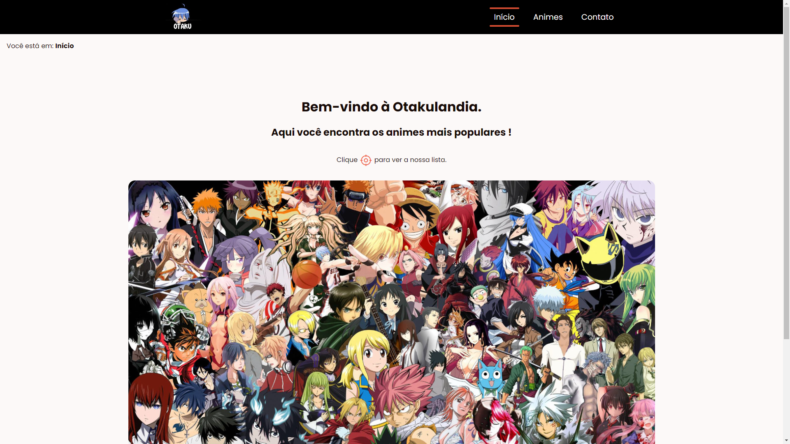
</div>

<hr />

## 🚀 Pontos de melhorias

### Mudança Global

### Header

#### Antes:

```
  <a href="#" class="logotipo">
    
  </a>
```

#### Depois:

```
  <a href="#" class="logotipo" aria-label="link para a página inicial">
    
  </a>
```

<br />
<br />

### HOME

#### Análise da página:

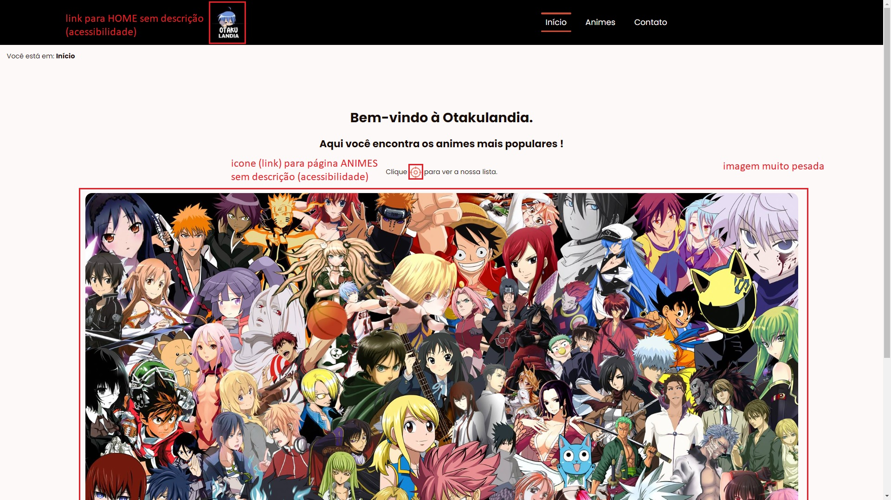

<br />

#### Avaliação do Lighthouse (anterior as mudanças):

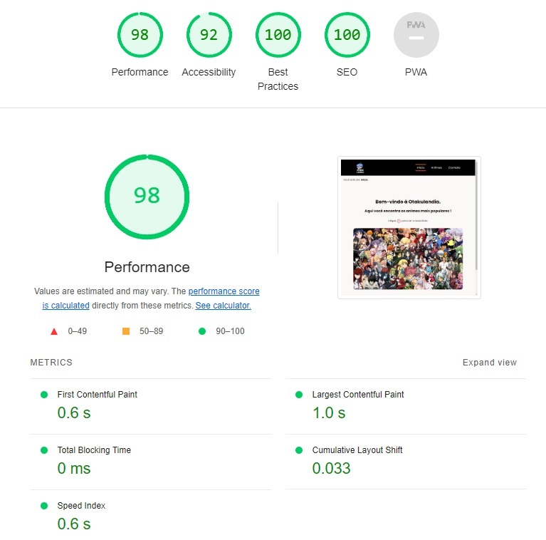

<br />

## Mudanças

### Main:

### No parágrafo: Clique (icone) para ver a nossa lista.

#### Antes:

```
  <p class="paragraph">
    Clique
    <a href="./pages/animes.html" class="link-to-animes">
      <i class="ph ph-crosshair"></i>
    </a>
    para ver a nossa lista.
  </p>
```

#### Depois:

```
  <p class="paragraph">
    Clique
    <a href="./pages/animes.html" class="link-to-animes">
      <i class="ph ph-crosshair" aria-label="link para a página animes"></i>
    </a>
    para ver a nossa lista.
  </p>
```

<br />

### Na única imagem:

#### Antes:

```
  <figure>
    
  </figure>
```

#### Depois:

```
  <figure>
    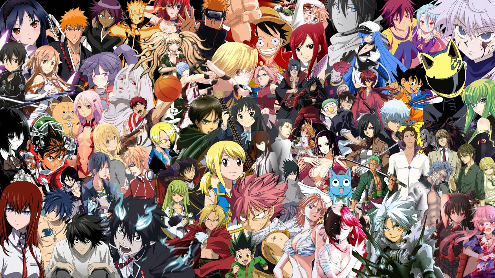
  </figure>
```

<br />

## Resultados obtidos:

#### Avaliação do Lighthouse (após as mudanças):

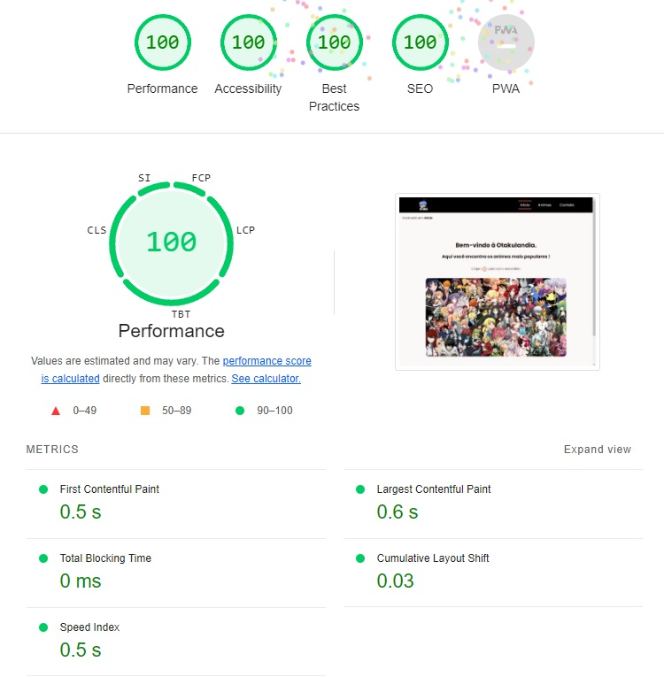

<br />

<hr />

### Animes

#### Análise da página:

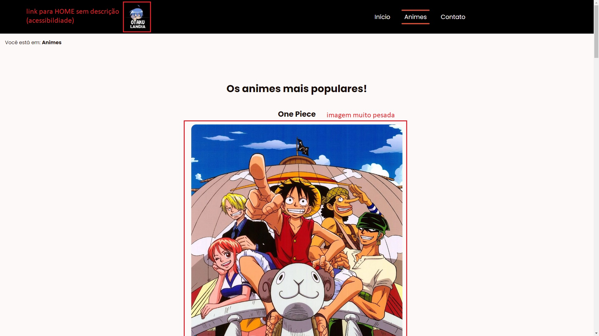

<br />

#### Avaliação do Lighthouse (anterior as mudanças):

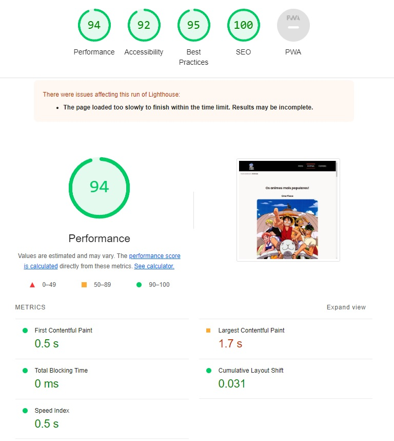

<br />

## Mudanças

### Main:

### Em todas as imagens da página:

- #### Redimensionei todas as imagens e mantive as proporções.
- #### Imagem página HOME:
  - #### Original 548KB
  - #### 1260 width = 411KB
  - #### 900 width = 231KB
  - #### 600 width = 114KB
  - #### 290 width = 34.9KB
- #### Imagens da página ANIMES:
  - #### One Piece:
    - #### Original 469KB
    - #### 550 width = 159KB
    - #### 290 width = 54.4KB
  - #### Jujutsu Kaisen:
    - #### Original 692KB
    - #### 550 width = 172KB
    - #### 290 width = 53.7KB
  - #### Tokyo Ghoul:
    - #### Original 245KB
    - #### 550 width = 118KB
    - #### 290 width = 43.4KB

#### Antes:

```
  <figure>
    
  </figure>
```

#### Depois:

```
  <figure>
    
  </figure>
```

<br />

## Resultados obtidos:

#### Avaliação do Lighthouse (após as mudanças):

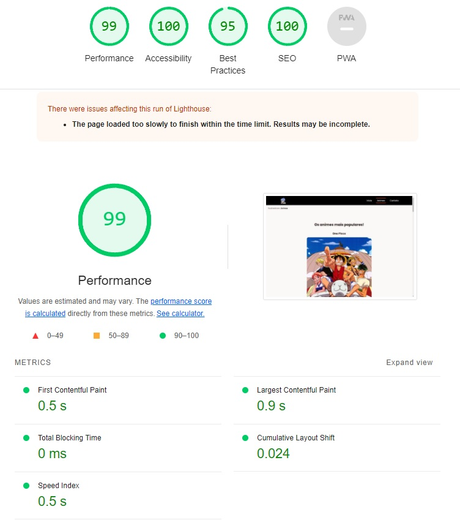

<br />

<hr />

### Contato

#### Análise da página:

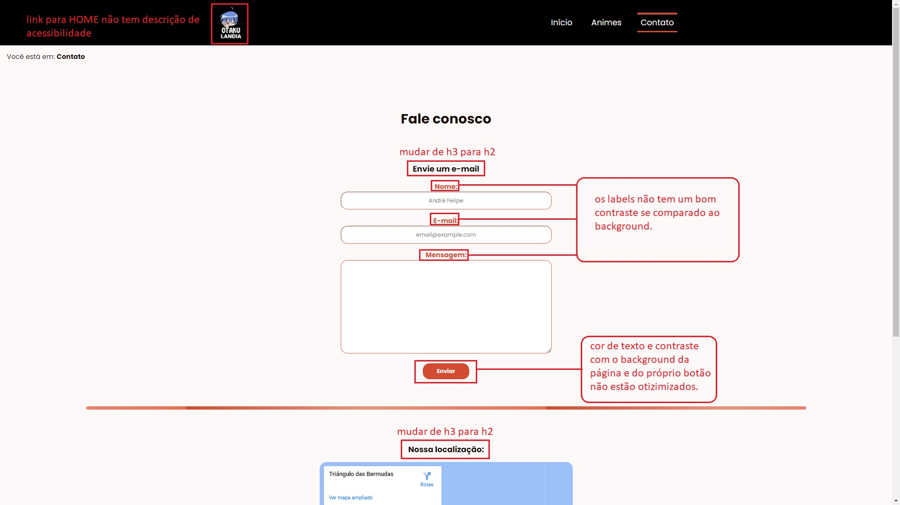

<br />

#### Avaliação do Lighthouse (anterior as mudanças):

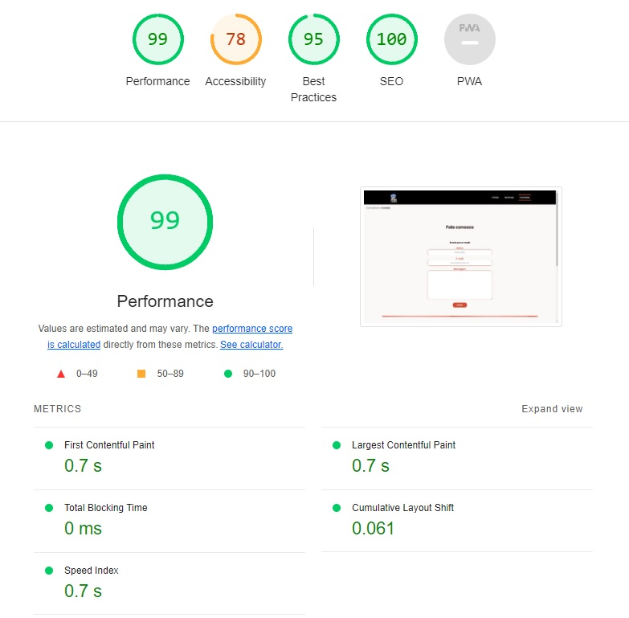

<br />

## Mudanças

### Main:

### No contraste de cores do formulário:

- #### Cores dos inputs e botões trocadas de branco para preto.

#### Antes:

```
/* CONTATO STYLES */

  .form-data {
  display: block;
  margin: 1rem 0;

  > label {
    display: block;
    color: var(--primary);
    font-weight: bold;
    }
}

  .ph-arrow-fat-line-right {
  display: none;
  position: absolute;
  font-size: 2rem;
  top: 0;
  left: 0;
  color: var(--background);
  background-color: var(--primary);
  width: 100%;
  border-radius: var(--border-radius);
  animation: arrow 0.5s ease-in-out infinite alternate;
}

/* GLOBAL STYLES */
.button {
  padding: 8px 32px;
  border-radius: var(--border-radius);
  background-color: var(--primary);
  color: var(--background);
  text-decoration: none;
  transition: all 0.2s ease-in-out;
  border: 2px solid transparent;
  font-weight: bold;
}

```

#### Depois:

```
/* CONTATO STYLES */

  .form-data {
  display: block;
  margin: 1rem 0;

  > label {
    display: block;

    font-weight: bold;
    }
}

  .ph-arrow-fat-line-right {
  display: none;
  position: absolute;
  font-size: 2rem;
  top: 0;
  left: 0;

  background-color: var(--primary);
  width: 100%;
  border-radius: var(--border-radius);
  animation: arrow 0.5s ease-in-out infinite alternate;
}

/* GLOBAL STYLES */
.button {
  padding: 8px 32px;
  border-radius: var(--border-radius);
  background-color: var(--primary);

  text-decoration: none;
  transition: all 0.2s ease-in-out;
  border: 2px solid transparent;
  font-weight: bold;
}

```

<br />

### Trocado ambas as tags H3 por H2:

#### Antes:

```
  <h3>Envie um e-mail</h3>
```

```
  <h3>Nossa localização:</h3>
```

#### Depois:

```
  <h2>Envie um e-mail</h2>
```

```
  <h2>Nossa localização:</h2>
```

<br />

### Adicionado title ao iframe com a localização do google maps:

#### Antes:

```
<div class="location">
  <h3>Nossa localização:</h3>

  <iframe
    src="https://www.google.com/maps/embed?pb=!1m18!1m12!1m3!1d97311.51596740977!2d-70.94462376547395!3d24.987851616399027!2m3!1f0!2f0!3f0!3m2!1i1024!2i768!4f1!3m3!1m2!1s0x89451ab5034cb7ab%3A0xb600ecf3df7aca4d!2sTri%C3%A2ngulo%20das%20Bermudas!5e0!3m2!1spt-BR!2sbr!4v1703635766739!5m2!1spt-BR!2sbr"
    width="600"
    title="localização do google maps da otakulandia"
    height="450"
     style="border: 0"
    allowfullscreen=""
    loading="lazy"
    referrerpolicy="no-referrer-when-downgrade"
   ></iframe>
</div>
```

#### Depois:

```
<div class="location">
  <h3>Nossa localização:</h3>

  <iframe
    src="https://www.google.com/maps/embed?pb=!1m18!1m12!1m3!1d97311.51596740977!2d-70.94462376547395!3d24.987851616399027!2m3!1f0!2f0!3f0!3m2!1i1024!2i768!4f1!3m3!1m2!1s0x89451ab5034cb7ab%3A0xb600ecf3df7aca4d!2sTri%C3%A2ngulo%20das%20Bermudas!5e0!3m2!1spt-BR!2sbr!4v1703635766739!5m2!1spt-BR!2sbr"
    width="600"
    height="450"
     style="border: 0"
    allowfullscreen=""
    loading="lazy"
    referrerpolicy="no-referrer-when-downgrade"
   ></iframe>
</div>
```

<br />

## Resultados obtidos:

#### Avaliação do Lighthouse (após as mudanças):

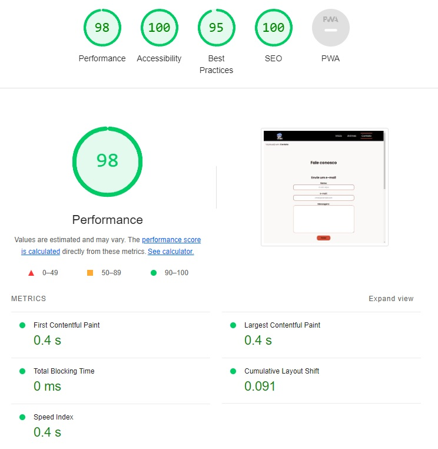

<br />

<hr />
