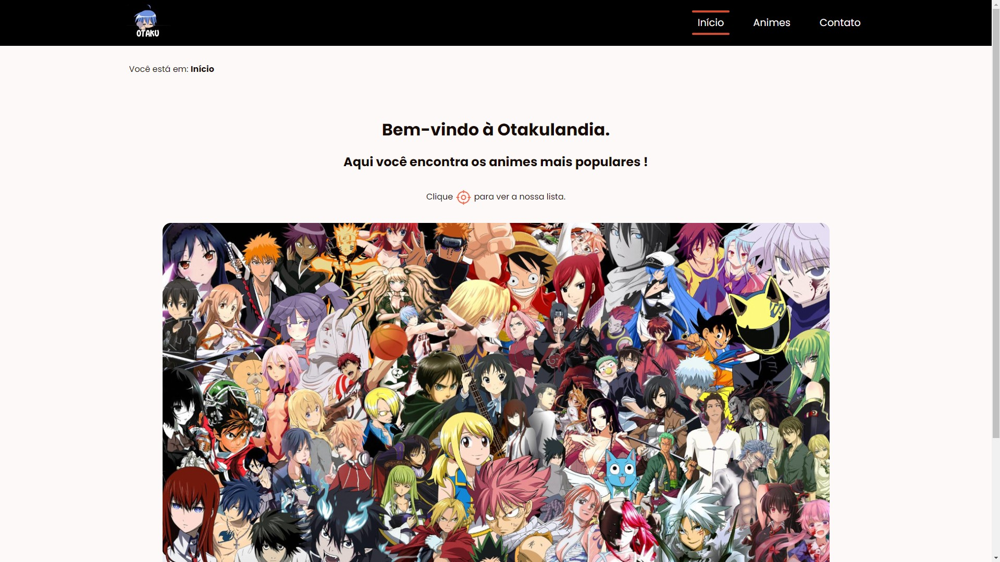
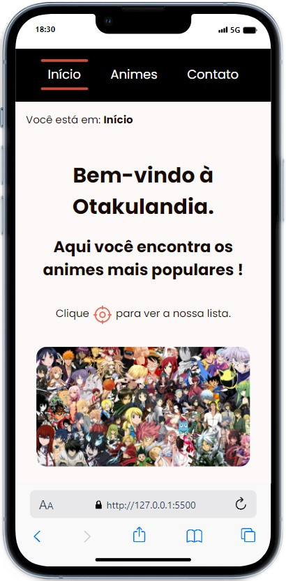
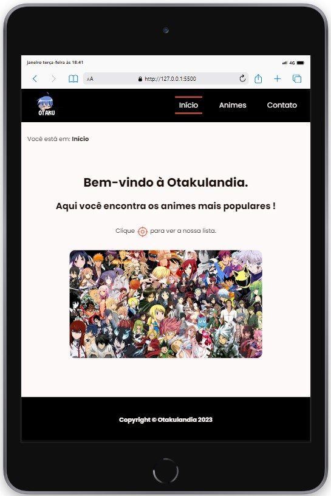
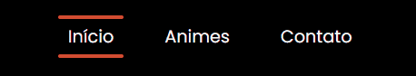
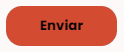
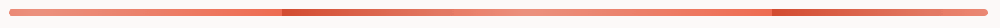

<h1 align="center"> Otakulandia </h1>

  <a href="#-tecnologias">Tecnologias</a>&nbsp;&nbsp;&nbsp;|&nbsp;&nbsp;&nbsp;
    <a href="#-como-rodar-o-projeto">Como rodar o projeto</a>&nbsp;&nbsp;&nbsp;|&nbsp;&nbsp;&nbsp;
  <a href="#-sobre-o-projeto">Sobre o projeto</a>&nbsp;&nbsp;&nbsp;|&nbsp;&nbsp;&nbsp;
  <a href="#-animações">Animações</a>&nbsp;&nbsp;&nbsp;

## 💻 DESKTOP

  

## 📱 Mobile

  

## 📱 Tablet

  

## 🥳 Animações

### Header

  

### Button (página de contato)

  

### Divisor (página anime e contato)

  

## 🚀 Tecnologias

Esse projeto foi desenvolvido com as seguintes tecnologias:

- HTML5</img>
- CSS3</img>

## ⚙️ Como rodar o projeto

Passo-a-passo:

1. Abra o index.html na pasta raiz do projeto.

## 💻 Sobre o Projeto

O projeto é um website onde você encontra informações sobre os animes mais populares.
