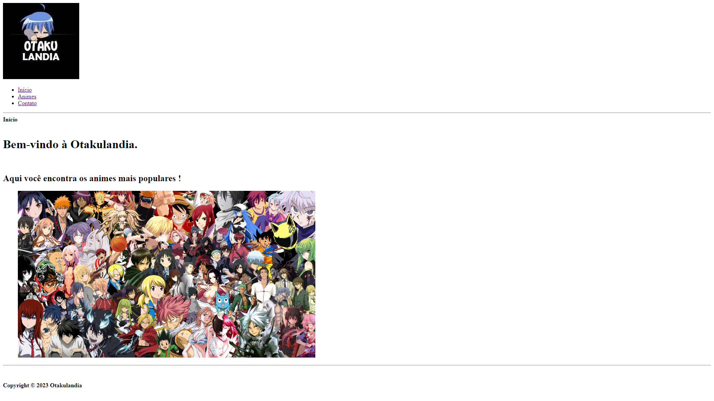

<h1 align="center"> Otakulandia </h1>

  <a href="#-tecnologias">Tecnologias</a>&nbsp;&nbsp;&nbsp;|&nbsp;&nbsp;&nbsp;
    <a href="#-instalacao-do-projeto">Instalação do projeto</a>&nbsp;&nbsp;&nbsp;|&nbsp;&nbsp;&nbsp;
  <a href="#-sobre-o-projeto">Sobre o Projeto</a>&nbsp;&nbsp;&nbsp;|&nbsp;&nbsp;&nbsp;
  <a href="#-gif">GIF</a>&nbsp;&nbsp;&nbsp;

  

## 🚀 Tecnologias

Esse projeto foi desenvolvido com as seguintes tecnologias:

- HTML5</img>

## ⚙️ Instalação do projeto

Passo-a-passo:

1. Abra o index.html na pasta raiz do projeto.

## 💻 Sobre o Projeto

O projeto é um website onde você encontra informações sobre os animes mais populares.

## 👀 GIF

  

